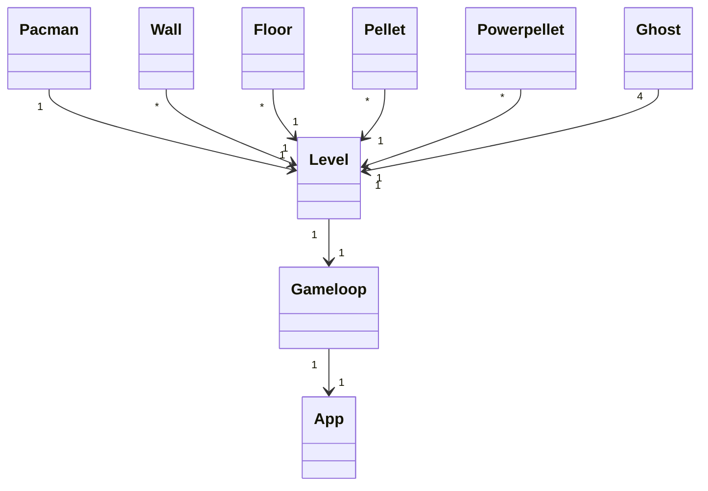
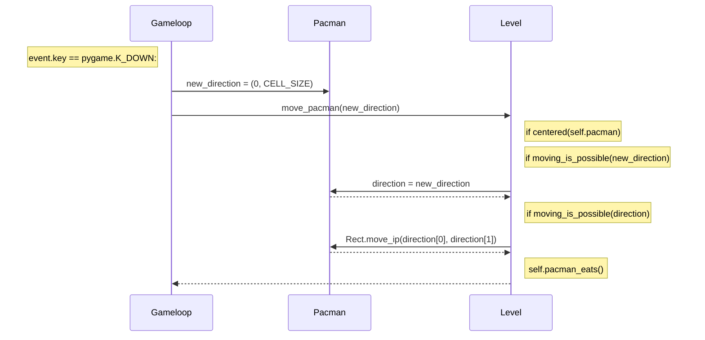
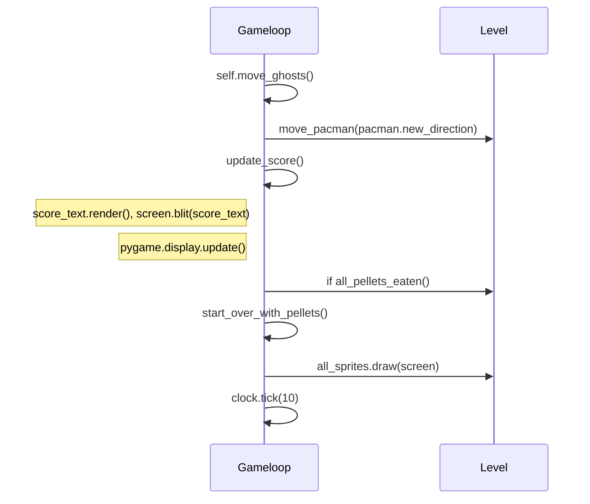

# Arkkitehtuurikuvaus
## Pakkausrakenne
Ohjelma muodostuu seuraavista pakkauksista: assets, gamelogic, levels, sprites ja ui. Näistä tärkeimmät ovat gamelogic, joka sisältää pelin toimintalogiikkaan liittyvän koodin ja ui, joka sisältää käyttöliittymään liittyvän koodin. Assets sisältää png-kuvia, joita sprites-pakkauksen luokat käyttävät. Sprites sisältää kaikki luokat, joista pelimaailman oliot rakentuvat. Levels pakkauksessa on pelikentän pohja ruudukkona.

## Sovelluslogiikka
Pelin käynnistys tapahtuu app.py-tiedostosta. App-luokassa luodaan Level-luokan instanssi, joka annetaan parametrinä Gameloop luokan määrityksessä. Gameloop-luokka muodostuu kolmesta päämetodista: 
- draw_starting_screen
- gameloop
- gameover

Nämä metodin suoritetaan tässä järjestyksessä. Jokaisella metodilla on alussa initialize-alkuinen apumetodin kutsu, jossa ruudun sisältö piirretään ja tehdään tarvittavat tietokannan toimenpiteet. Tämän jälkeen suoritetaan silmukassa metodia, joka tarkistaa pygame-event tapahtumia. Tarkistettavat asiat vaihtelevat siitä, missä vaiheessa pelin suoritus on menossa. Esimerkiksi draw_starting_screen metodin aikana tarkistetaan painaako pelaaja välilyöntiä. Gameloop-metodissa taas fokus on pelaajan painamilla nuolinäppäimillä. Gameover-metodissa on omat toimintonsa sille saako pelaaja laittaa nimensä huipputuloksiin vai ei.

Pelin toiminnoista suurin osa toteutetaan handle_gameloop_events()-metodissa event-silmukassa. Peli etenee kierroksittain. Jokaisen kierroksen aikana:
- Tarkistetaan painoiko pelaaja nuolinäppäintä
- Päivitetään kierros
- Tarkistetaan tapahtuiko törmäystä (tässä tapauksessa törmäys tarkoittaa tilannetta, jossa elämät loppuvat ja peli päättyy).

Silmukassa ollessa pelin tapahtumat toteutetaan Level-luokan metodikutsuilla ja muutamassa tapauksessa spriten (Ghost tai Pacman) metodeilla.

## Luokkakaavio keskeisistä luokista

## Sekvenssidiagrammi Pacman-luokan spriten liikuttamisesta. 
Kyseisessä tilanteessa Pacman liikkuu y-akselilla alaspäin.

Tapahtumaketju update_round()-metodia kutsuttaessa.

