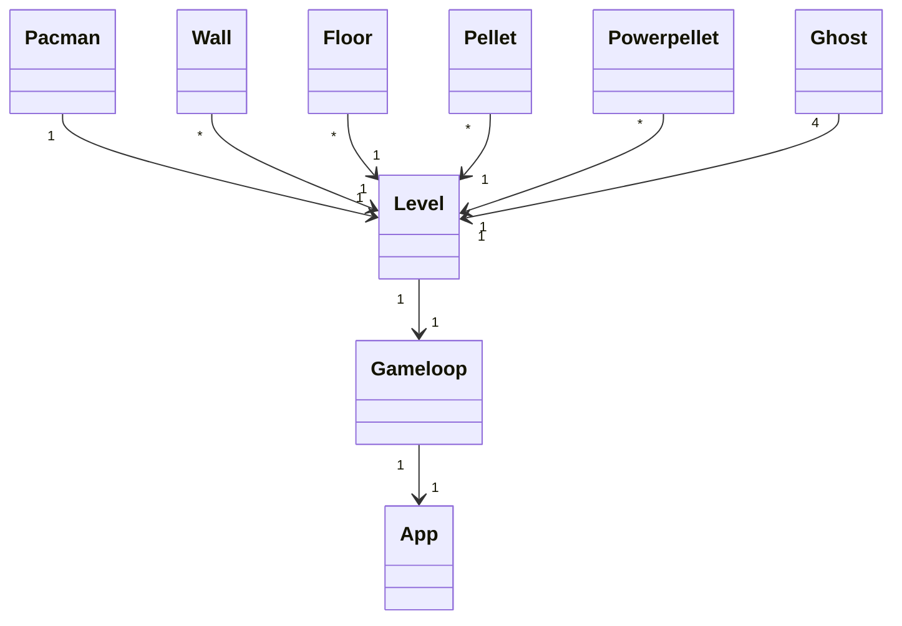
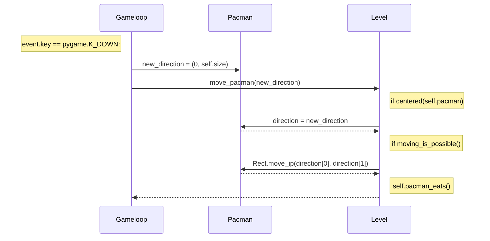

# Arkkitehtuurikuvaus
## Pakkausrakenne
Ohjelma muodostuu seuraavista pakkauksista: assets, gamelogic, levels, sprites ja ui. Näistä tärkeimmät ovat gamelogic, joka sisältää pelin toimintalogiikkaan liittyvän koodin ja ui, joka sisältää käyttöliittymään liittyvän koodin. Assets sisältää png-kuvia, joita sprites pakkauksen luokat käyttävät. Sprites sisältää kaikki luokat, joista pelimaailman oliot rakentuvat. Levels pakkauksessa on pelikentän pohja ruudukkona.

## Sovelluslogiikka
Pelin käynnistys tapahtuu app.py-tiedostosta. App-luokassa luodaan Level-luokan instanssi, joka annetaan parametrinä Gameloop luokan määrityksessä. Gameloop-luokasta kutsutaan ensin `draw_starting_screen` metodia joka piirtää näytölle aloitusruudun. Kun haluttua näppäintä painetaan, poistutaan tästä metodista ja kutsutaan `gameloop` metodia.

Tämä aloittaa itse pelin toiminnan. Gameloop-metodissa tarkistetaan silmukassa ensin onko jotakin näppäintä painettu, jonka jälkeen päivitetään tapahtumat. Silmukassa ollessa pelin tapahtumat toteutetaan Level-luokan metodikutsuilla ja muutamassa tapauksessa spriten (Ghost tai Pacman) metodeilla.

Tätä jatketaan kunnes elämät loppuvat, jolloin kutsutaan `gameover` metodia, joka piirtää näytölle tekstin "Game Over" ja näyttää pelaajan pistesaldon. 

## Luokkakaavio keskeisistä luokista

## Sekvenssidiagrammi Pacman-luokan spriten liikuttamisesta. 
Kyseisessä tilanteessa Pacman liikkuu y-akselilla alaspäin.

