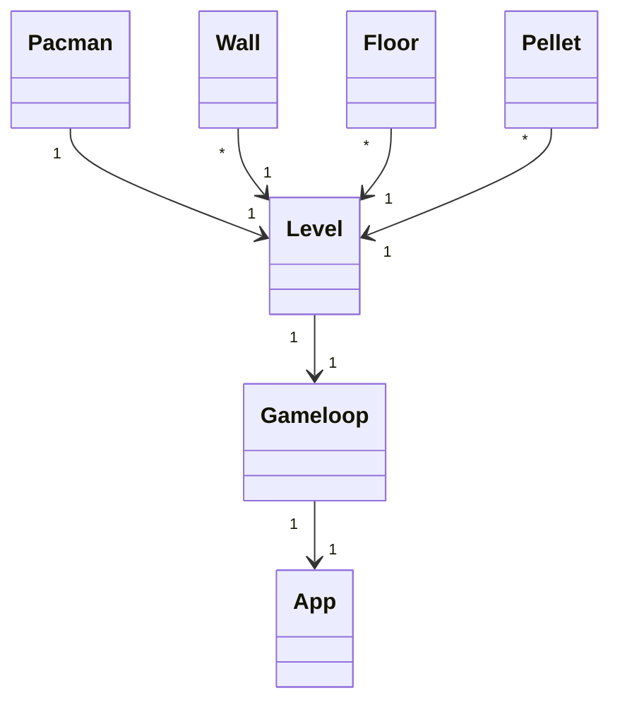

Sekvenssidiagrammi Pacman-spriten liikuttamisesta. Kyseisessä tilanteessa Pacman liikkuu y-akselilla alaspäin.
```mermaid
sequenceDiagram
	Gameloop->>Pacman: direction = [0, self.size]
	Pacman-->>Gameloop;
	Gameloop->>Level: move_pacman()
	Note right of Level: if moving_is_possible()
	Level->>Pacman: Rect.move_ip(direction[0], direction[1])
	Pacman-->>Level;
	Note rigth of Level: self.pacman_eats()
	Level-->>Gameloop;
```
