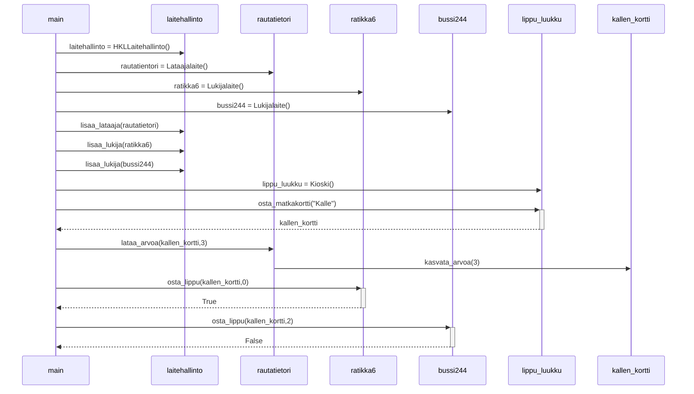

```mermaid
sequenceDiagram
	main->>laitehallinto: laitehallinto = HKLLaitehallinto()
	main->>rautatietori: rautatientori = Lataajalaite()
	main->>ratikka6: ratikka6 = Lukijalaite()
	main->>bussi244: bussi244 = Lukijalaite()
	main->>laitehallinto: lisaa_lataaja(rautatietori)
	main->>laitehallinto: lisaa_lukija(ratikka6)
	main->>laitehallinto: lisaa_lukija(bussi244)
	main->>lippu_luukku: lippu_luukku = Kioski()
	main->>+lippu_luukku: osta_matkakortti("Kalle")
	lippu_luukku-->>-main: kallen_kortti
	main->> rautatietori: lataa_arvoa(kallen_kortti,3)	
	rautatietori ->> kallen_kortti: kasvata_arvoa(3)
	main->>+ratikka6: osta_lippu(kallen_kortti,0)
	ratikka6-->>-main: True 
	main->>+bussi244: osta_lippu(kallen_kortti,2)
	bussi244-->>-main: False
```
