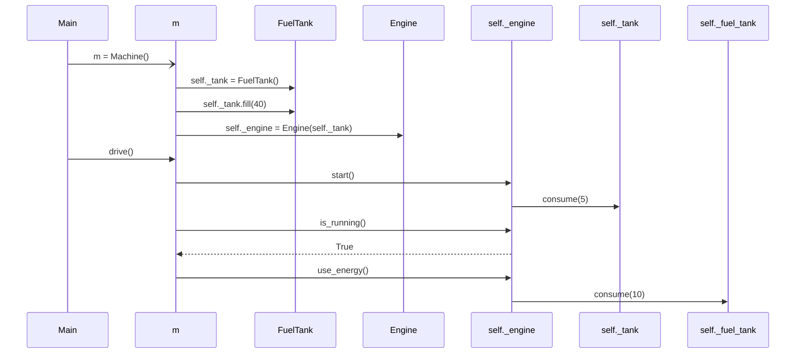

```mermaid
sequenceDiagram
	Main -) m: m = Machine()
	m ->> FuelTank: self._tank = FuelTank()
	m ->> FuelTank: self._tank.fill(40)
	m ->> Engine: self._engine = Engine(self._tank)
	Main ->> m: drive()
	m ->> self._engine: start()
	self._engine ->> self._tank: consume(5)
	m ->> self._engine: is_running()
	self._engine -->> m: True
	m ->> self._engine: use_energy()
	self._engine ->> self._fuel_tank: consume(10)  
```
