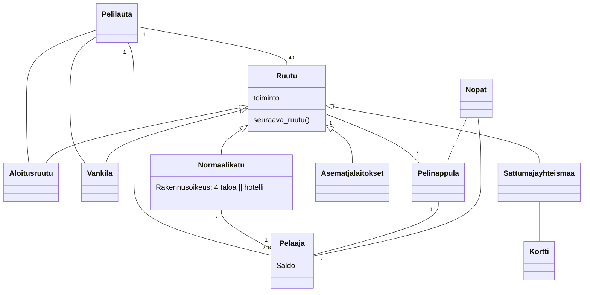

```mermaid
classDiagram
	Pelilauta "1" -- "40" Ruutu
	Pelilauta "1" -- "2..8" Pelaaja
	Pelilauta -- Aloitusruutu
	Pelilauta -- Vankila
	Ruutu "1" -- "*" Pelinappula
	Ruutu <|-- Aloitusruutu
	Ruutu <|-- Vankila
	Ruutu <|-- Sattuma ja yhteismaa
	Ruutu <|-- Asemat ja laitokset
	Ruutu <|-- Normaali katu
	Sattuma ja yhteismaa -- Kortti
	Normaali katu "*" -- "1" Pelaaja
	Pelinappula "1" -- "1" Pelaaja
	Nopat -- Pelaaja
	Nopat .. Pelinappula
	class Ruutu {
	    seuraava_ruutu()
	    toiminto
	}
	class Normaali katu {
	    Rakennusoikeus: 4 taloa || hotelli
	}
	class Pelaaja {
	    Saldo
	}
```
